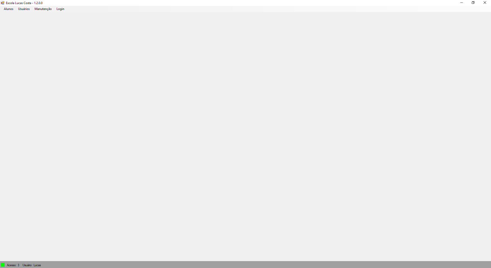

<h1 align="center">Meu 1° projeto</h1>

Projeto desenvolvido completamente por mim para fins de aprendizado.

  <a href="#-tecnologias">Tecnologias</a>&nbsp;&nbsp;&nbsp;|&nbsp;&nbsp;&nbsp;
  <a href="#-projeto">Projeto</a>&nbsp;&nbsp;&nbsp;|&nbsp;&nbsp;&nbsp;
  <a href="#memo-licença">Licença</a>

  

 

  

## 🚀 Tecnologias

Esse projeto foi desenvolvido com as seguintes tecnologias:

- Windows Forms
- C#
- SQLite
- Git e Github

## 💻 Projeto

O Gym Software é um projeto que simula o formulário padrão de controle de uma academia, onde há máscaras em alguns inputs, utilização de diversos componentes visuais, interações com elementos gráficos, além de um banco de dados que facilita o armazenamento das informações dos alunos, professores e da grade de horários. 

## :memo: Licença

Esse projeto está sob a licença MIT.
